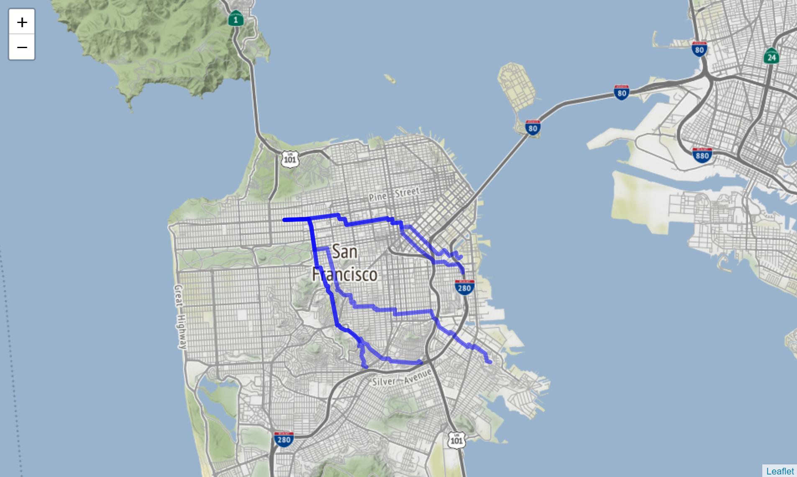

# Challenger - Graphs

This submodule is focused on graphs. This was less often needed, as using graph is generally more complex and needs more time than a hackathon. Nonetheless, something I have been using a lot is the provided optimized Dijkstra algorithm. It enables me to fast-prototype any **shortest path** solution problem, but also quickly build any resource dispatching solution that we usually come accross in hackathons.

## Call Dijkstra

```python
# Define a mock graph, with each node having an edge dictionnary
graph = {'a': {'b': 1}, 
         'b': {'c': 2, 'b': 5}, 
         'c': {'d': 1},
         'd': {}}
# Find the shortest path between two keys
ShortestPath(graph).dijkstra('a', 'c')
```

## Map a city

That was a fun problematic, that you can read more about in [Project AsTeR](https://github.com/Coricos/AsTeR), and consisted in mapping any city to actually dispatch emergency units in the smartest way possible. It was necessary to build a representative graph of any path possible, to be updating that graph real-time if needed, and to provide dispatcher with that Dijkstra output visualisation.

For that purpose, the object _CityGraph_ has been build, transforming a _shapefile_ into a serialized dictionnary easily accessible, whose nodes are formatted _longitude:latitude_. The Dijkstra implementation can then be run on top of it, in a transparent manner with the _Trajectory_ object which loads that same graph and compute shortest path based on any coordinates.

An example of such computation and the resulting visualization with _folium_ is given here:

```python
# Load the processed San Francisco map
trj = Trajectory('../datasets/sanfrancisco.jb')
# Extract 6 random nodes
obj = np.random.choice(list(trj.G.keys()), 6)
# Center the map around San Francisco central coordinates
map_center_coordinates = (37.7749, -122.4194)
# Defines a folium map
m = folium.Map(location=map_center_coordinates, tiles="Stamen Terrain", zoom_start=12)
# Keep one point as starting point, and link that point to 5 possible positions
for i in range(5):
    pth = trj.shortest_path(obj[0], obj[i+1])
    pts = np.asarray([np.asarray(e.split(':')).astype('float')[::-1] for e in pth])
    folium.PolyLine(pts, color="blue", weight=5, opacity=0.5).add_to(m)
```

