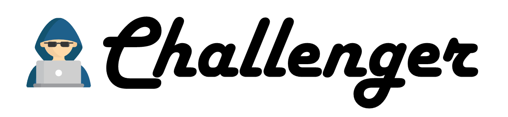

`Author: Meryll Dindin`

This package fosters a lot of reusable components that you can easily plug into any of your project. A lot is being developed currently, as I add more and more automation and documentation. Feel free to participate in the elaboration of this open-source package!

Read about the project on [Medium](https://towardsdatascience.com/challenger-a-fast-prototyping-project-f3d97265529c)

## Set up a whole new environment:

```bash
git clone https://github.com/Coricos/Challenger.git
virtualenv -p python3 Challenger
cd Challenger
source bin/activate
pip install -r requirements.txt
```

## For Jupyter lovers, add the environment to your list of kernels:

```bash
pip install jupyter notebook ipython ipykernel
python -m ipykernel install --user --name=challenger
```

## General project architecture:


## Project usages so far:

* [Thrive Education](https://thrive-education.co)
* [Project AsTeR](https://www.project-aster.com)
* [Project Element](https://www.project-element.com)
* [Dillygence](https://dillygence.com)
* [Dreem Data Challenge](https://towardsdatascience.com/my-sweet-dreams-about-automatic-sleep-stage-classification-414128441728)