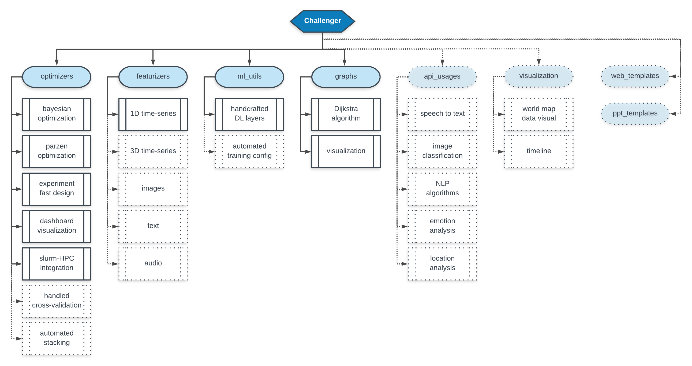

# Challenger

Hackathons, it all began with hackathons. Their intrinsic functioning is simple: design a new product in a limited amount of time and convince a jury that this product is worth being used by people. The difference I make here is generally game-changing, as a good product without a good story will not affect any audience, and similarly, a good story without a good product is a sloppy path very dependent on the technical skills of the jury. Making compromises to get a good version of both (no need for perfection) will generally lead you to a podium. Having done dozens of those, task redundancy struck me, especially when the product is about leveraging machine learning to solve a well-identified problem.

As I personally hate losing time doing the same things all over again, I designed this python package as my task reliever for any of my small projects. You will notice that it is merely focused on data science tasks for now, as this is what I have been mainly doing for the past years. It helps me for data preprocessing, machine learning model fitting in a controlled and reproducible environment (which generally takes time that you do not have), graphs utilization and visualization, APIs calls, general data visualization, Flask web server templates and PowerPoint presentation to make sure the story-telling is covering everything it should.

Through my multiple experiences, I have noticed that parts of those projects can be automated, and releasing this open-source package is my attempt to give everyone this toolbox to play with.

## General Project Architecture and Roadmap

